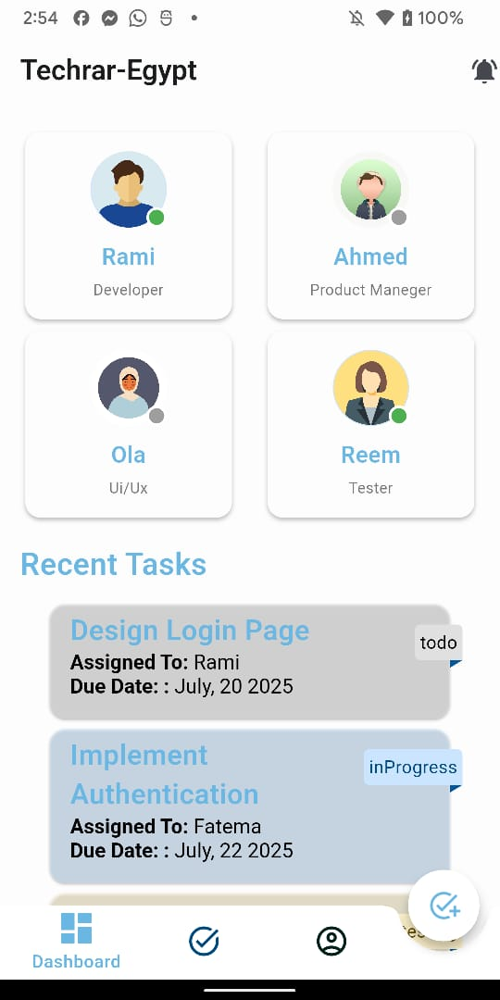
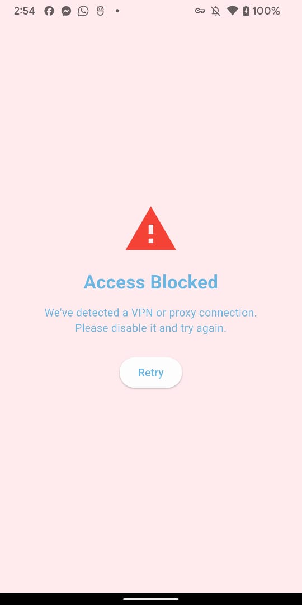
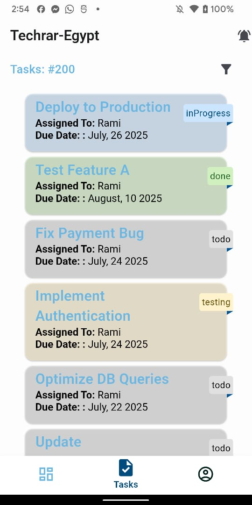
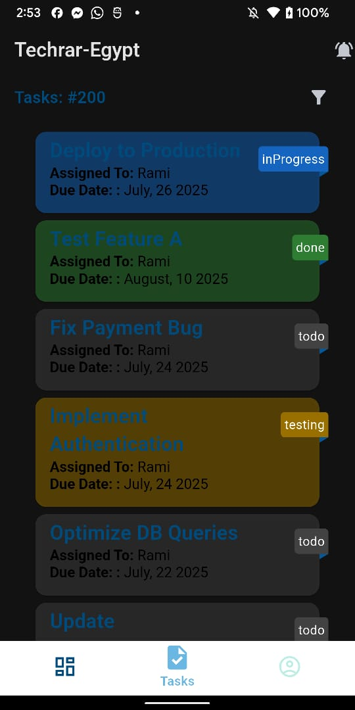
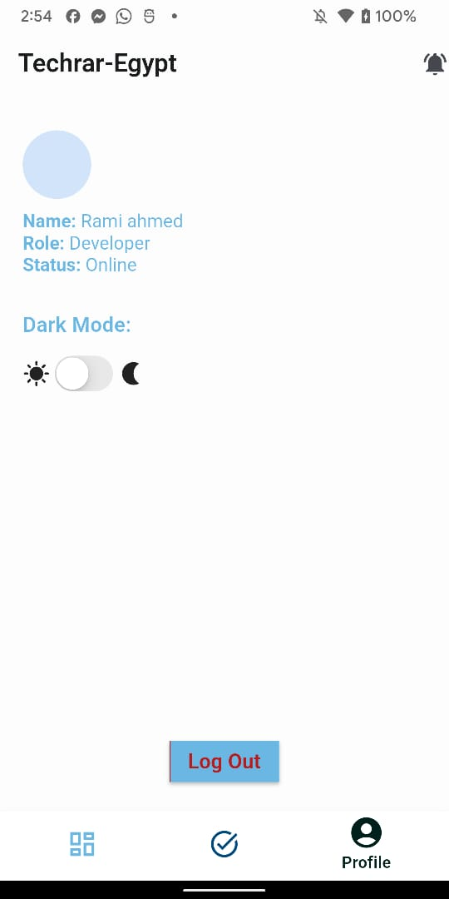
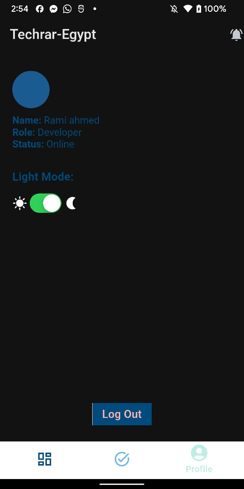

# 🛡️ Flutter Spoofing Detection Dashboard

This Flutter application includes a native Android integration to detect spoofing techniques like VPN, emulator, MAC spoofing, DNS spoofing, and proxy usage. Below is a complete guide to setting up, running, and understanding the purpose of the spoofing detection logic.

---

## 🚀 1. Getting Started

### ✅ App-Download-Link and show videos

!🎥 [Ui_show](assets/docs/videos/ui_show.mp4)
!🎥 [VPN Check_video](assets/docs/videos/vpn_detection.mp4)

### ✅ App-Info
- Flutter SDK 3.32.4, Channel stable
- Google`s Clean Architecture for scalability
- Architecture [Google Architecture](https://developer.android.com/topic/architecture)
- Modularization [Google Modularization](https://developer.android.com/topic/modularization)
- Spoofing Detection using native Android integration, Apple soon..
- Isolates for filtring heavy data
- Dark/Light theme switching using Riverpod
- Assists can be changeable from an environment file in lib/app/flavor_configs and lib/core/utils/assets file.
- API Mocking, mocks founds in assets/mock
- D.I using Riverpod and serializing using Freezed Generators

### ✅ Prerequisites
- Flutter SDK 3.x.x
- Android Studio or VS Code
- Android device/emulator (physical device recommended for full spoofing tests)

### 🛠️ Setup

```bash
git clone https://github.com/your-repo/flutter-spoofing-detector.git
cd ..path/techrar_project_team_dashboard
flutter pub get
```

### ▶️ Run the App

```bash
flutter run
```

> Ensure you have connected a physical device or started an emulator before running the app.
> in case of emulator insure that the isEmulator bool is false at android/app/src/main/kotlin/.../MainActivity.kt
---

## 🖼️ 2. Screenshots

Below are some visual examples from the app.

### ✅ Dashboard




### ✅ VPN Detection Result



### ✅ Tasks & Profile





---

## 🧩 3. Native Spoofing Detection (Android)

This project uses a platform channel (`spoofing_detector`) to communicate between Flutter and native Kotlin code.

### 📡 Supported Native Methods:
| Method          | Description                                        |
|------------------|----------------------------------------------------|
| `isUsingVpn`     | Detects active VPN on the device                  |
| `isEmulator`     | Checks if the device is an emulator               |
| `isMacSpoofed`   | Verifies if the MAC address is randomized         |
| `isUsingProxy`   | Detects any system proxy usage                    |
| `isDnsSpoofed`   | Compares local DNS resolution vs DNS-over-HTTPS  |

### 🧠 How It Works

- The Flutter app sends method calls using a `MethodChannel`.
- Native Kotlin code in `MainActivity.kt` handles each method.
- Functions return a boolean indicating if spoofing is detected.

### ✅ Example Flutter Call

```dart
const platform = MethodChannel('spoofing_detector');

final isVpn = await platform.invokeMethod('isUsingVpn');
final isSpoofed = await platform.invokeMethod('isDnsSpoofed', {
  'domain': 'google.com',
});
```

### 📂 Native Implementation Location

```
android/app/src/main/kotlin/.../MainActivity.kt
```
